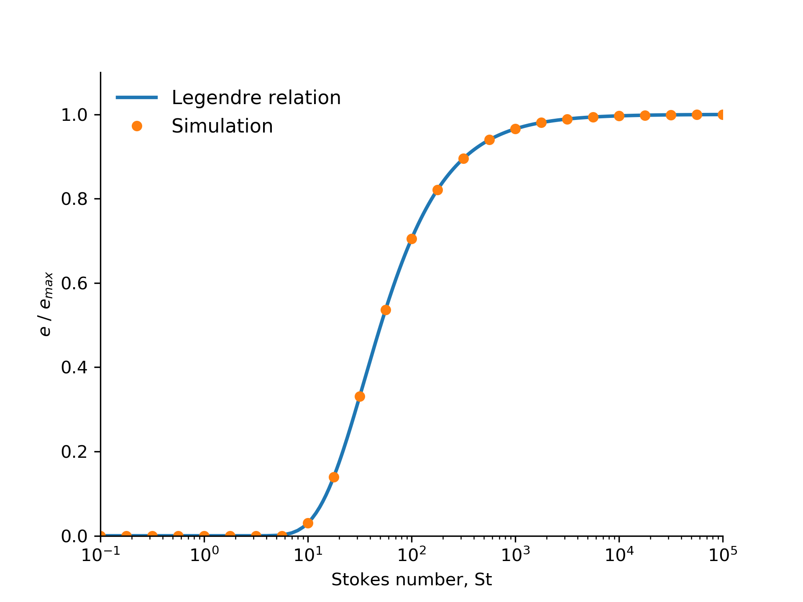

# StokesWallMPPIC
OpenFOAM-6 code to model particle-wall rebound damping due to lubrication forces. 

The coefficient of restitution (velocity after collision/velocity before collision), varies with a sigmoid as the Stokes number increases, as given by Legendre et al. (2005)

# Citation
Legendre, D., Daniel, C. and Guiraud, P., 2005. Experimental study of a drop bouncing on a wall in a liquid. Physics of Fluids, 17(9), p.097105.
